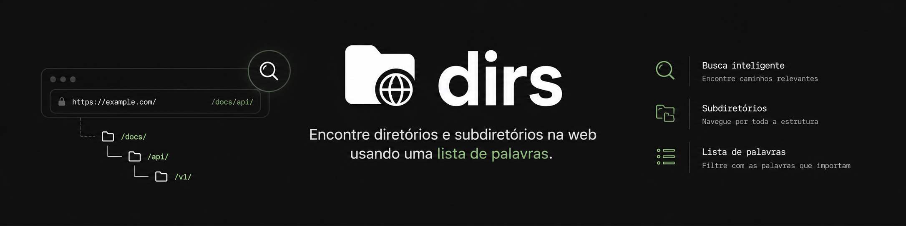

<p align="center">
  
</p>

# Olá, este é o dirs!
> O dirs é uma ferramenta focada em enumeração de diretórios e subdiretórios na web a partir de listas de palavras. O projeto permite identificar caminhos válidos em aplicações web de forma rápida e eficiente, utilizando buscas automatizadas baseadas em wordlists customizadas.


---

## Exemplo de uso

```
$ python dirs.py -u https://example.com -w wordlist.txt --mode all

[dirs] Alvo   : https://example.com
[dirs] Wordlist: wordlist.txt (4729 entradas)
[dirs] Modo   : all
────────────────────────────────────────────────
[200] https://example.com/admin
[200] https://example.com/login
[301] https://example.com/assets
[403] https://example.com/config
[200] https://example.com/api/v1
────────────────────────────────────────────────
[+] 5 caminhos encontrados em 12.4s
```

---

## Features

- 📂 **Enumeração simultânea** de diretórios e subdiretórios
- 🗂️ **Modo seletivo** — liste apenas diretórios ou apenas subdiretórios
- ⏱️ **Delay configurável** entre requisições para controle de taxa

---

## Instalação

**Pré-requisitos:** Python 3.8+

```bash
git clone https://github.com/mat7heus/dirs.git
cd dirs
pip install -r requirements.txt
```

---

## Quick Start

```bash
python dirs.py -u <URL> -w <WORDLIST> --mode <MODO DE BUSCA>
```

---

## Exemplos de uso

**Scan básico:**

```bash
python dirs.py -u https://example.com -w wordlists/common.txt
```

**Listar apenas diretórios:**

```bash
python dirs.py -u https://example.com -w <WORDLIST> --mode dirs
```

**Listar apenas subdiretórios:**

```bash
python dirs.py -u https://example.com -w <WORDLIST> --mode subdirs
```

**Scan com delay de 1s entre requisições:**

```bash
python dirs.py -u https://example.com -w <WORDLIST> --delay 1
```

---

## Flags e parâmetros

| Flag               | Tipo     | Padrão | Descrição                                      |
|--------------------|----------|--------|------------------------------------------------|
| `-u`, `--url`      | `string` | —      | URL alvo (obrigatório)                         |
| `-w`, `--wordlist` | `path`   | —      | Caminho para a wordlist (obrigatório)          |
| `--mode`           | `string` | —      | Modo de listagem: `all`, `dirs`, `subdirs` (obrigatório) |
| `--delay`          | `float`  | `0`    | Intervalo em segundos entre requisições        |
| `-h`, `--help`     | —        | —      | Exibe esta mensagem de ajuda e sai             |

---

## Roadmap

- [ ] Enumeração de diretórios e subdiretórios via wordlist
- [ ] Modo seletivo (`dirs`, `subdirs`, `all`)
- [ ] Delay configurável entre requisições
- [ ] Suporte a exportação em JSON e CSV
- [ ] Opção de recursão em profundidade
- [ ] Suporte a autenticação (cookies / headers customizados)
- [ ] Relatório com estatísticas detalhadas
- [ ] Integração com proxies e Tor

---

## Contribuição

Contribuições são bem-vindas! Sinta-se à vontade para abrir uma [issue](https://github.com/mat7heus/dirs/issues) ou enviar um pull request.

1. Faça um fork do projeto
2. Crie uma branch (`git checkout -b feature/nova-funcionalidade`)
3. Commit suas alterações (`git commit -m 'Adiciona nova funcionalidade'`)
4. Faça push (`git push origin feature/nova-funcionalidade`)
5. Abra um Pull Request

---

## Licença

Distribuído sob a licença MIT. Consulte o arquivo [LICENSE](LICENSE) para mais detalhes.

---

> **Aviso legal:** esta ferramenta é destinada exclusivamente a testes de segurança autorizados. O uso em sistemas sem permissão explícita é ilegal e de responsabilidade exclusiva do usuário.